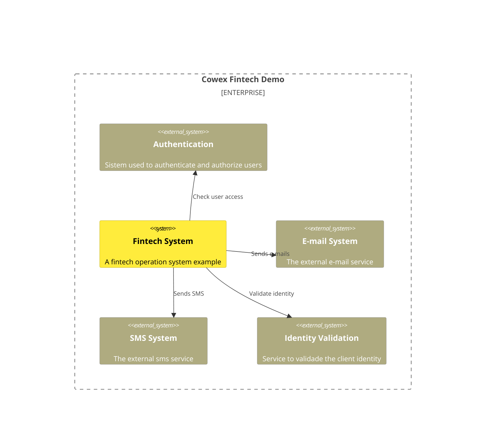

# Solution Architecture

!!! quote "Building" 
    Not yet on here. This document will be here as soon as possible!

```mermaid
C4Context
    Enterprise_Boundary(enterprise, "Cowex Fintech Demo") {
        System_Ext(login, "Authentication", "Sistem used to authenticate and authorize users")
        System(fintech, "Fintech System", "A fintech operation system example ")
        System_Ext(email, "E-mail System", "The external e-mail service")
        System_Ext(sms, "SMS System", "The external sms service")
        System_Ext(identity, "Identity Validation", "Service to validade the client identity")
    }

    Rel(fintech, email, "Sends e-mails")
    Rel(fintech, sms, "Sends SMS")
    Rel(fintech, identity, "Validate identity")
    Rel(fintech, login, "Check user access")

    UpdateElementStyle(fintech, $fontColor="black", $bgColor="#ffec3c", $borderColor="#b8a500")

    UpdateElementStyle(email, $textColor="black", $bgColor="#afab80", $offsetX="5")
    UpdateElementStyle(sms, $textColor="black", $bgColor="#afab80", $offsetX="5")
    UpdateElementStyle(identity, $textColor="black", $bgColor="#afab80", $offsetX="5")
    UpdateElementStyle(login, $textColor="black", $bgColor="#afab80", $offsetX="5")
```

## Digital Wallet

## Client Registration

## Operation

## Backend For Frontend