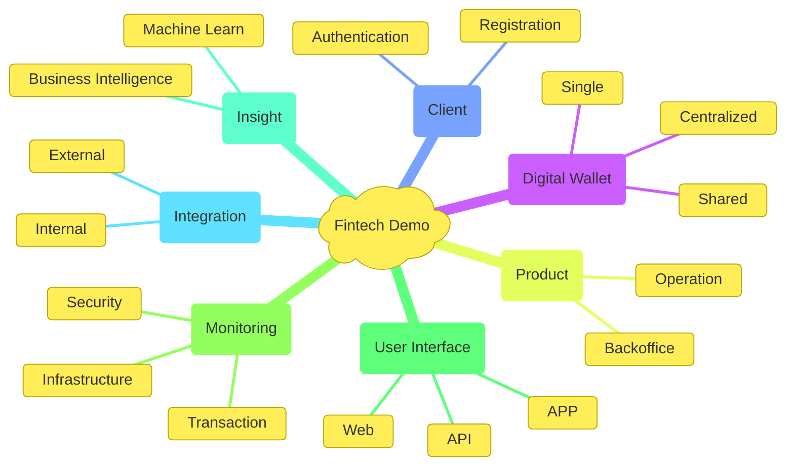

Fintech is a financial technology company, that is, companies that use technological innovation to provide financial services in a more efficient, accessible and innovative way.

Based on it description, we create this example project whose main objective is to demonstrate the ability of the group of architects, engineers, and developers to plan, manage and develop robust and high-performance software, always worrying about the objective, malleability, and time to market. 

## Mindmap

Presented below, in the form of a mind map, there is our conception of a core platform for operating a fintech in the initial phase.

## The View

In our view, the cornerstone for building a platform for a fintech is the trinity of Customer, Product, and Digital Wallet. These three working together enable fluid dynamics for any kind of fintech.

Having as the heart of this model, the digital wallet acts independently of the two other entities of this trinity, which means that validation actions at the product and user level are previously carried out asynchronously, thus enabling a gain in performance.

Alongside the core trinity, there is the observability provider duo that is made up of Insight and monitoring. This duo must provide easy access to technical and business health information, which helps fintech to understand the business itself, find possible problems and their causes, and also make some predictions based on the data collected.

Finally, we have the Interoperability duo, which is made up of User Interface and Integration. This duo enables controlled access to the fintech environment, thus ensuring pleasant interaction with the user and robust integration with peripheral systems.

You can find more information about this solution in [Solutions](./solution/about.md) and [Architecture](./architecture/solution.md). Take the time to read these modules in detail, it may make difference when using part of this code or even designing something similar.

## License

This program is free software: you can redistribute it and/or modify it under the terms of the [GNU Affero General Public License](./license.md) as published by the Free Software Foundation, either version 3 of the License, or (at your option) any later version.

This program is distributed in the hope that it will be useful, but __WITHOUT ANY WARRANTY__; without even the implied warranty of __MERCHANTABILITY__ or __FITNESS FOR A PARTICULAR PURPOSE__.  See the [GNU Affero General Public License](./license.md) for more details.

You should have received a copy of the GNU Affero General Public License
along with this program.  If not, see <[https://www.gnu.org/licenses/agpl-3.0](https://www.gnu.org/licenses/agpl-3.0.en.html)>.