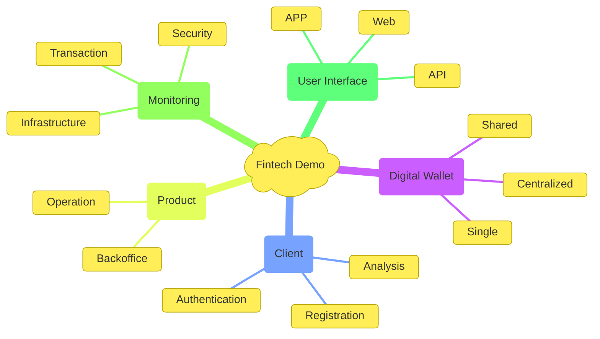

!!! quote "Alert"
    This is a demos software created as a development test case.  


<script type="module">
import mermaid from 'https://cdn.jsdelivr.net/npm/mermaid@10/dist/mermaid.esm.mjs';
let config = { 
    startOnLoad: true,
    loglevel: 0,
    theme: 'default',
};
mermaid.initialize(config);
</script>

<!-- ```mermaid
graph TD
  A[Cowex Fintech Demo] --- B[Digital Wallet];
  A --- c[Client Registration];
  A --- D[Operation];
  A --- E[Client Interface];
  E --- F[APP];
  E --- G[Web];
  E --- H[API];

  classDef default fill:#ffec3C,stroke:#B8A500,stroke-width:1.5px;
  classDef edge stroke:#B8A500
``` -->

<!-- ```mermaid
%%{
  init: {
    'theme': 'base',
    'themeVariables': {
      'primaryColor': '#ffec3c',
      'primaryTextColor': '#000',
      'primaryBorderColor': '#000',
      'lineColor': '#F8B229',
      'secondaryColor': '#ffec3C',
      'tertiaryColor': '#ffec3C'
    }
  }
}%%
mindmap
    )Fintech Demo(
        [Digital Wallet]
        [Client Management]
        [Operations]
        (User Interface)
            [APP]
            [Web]
            [API] 
``` -->

