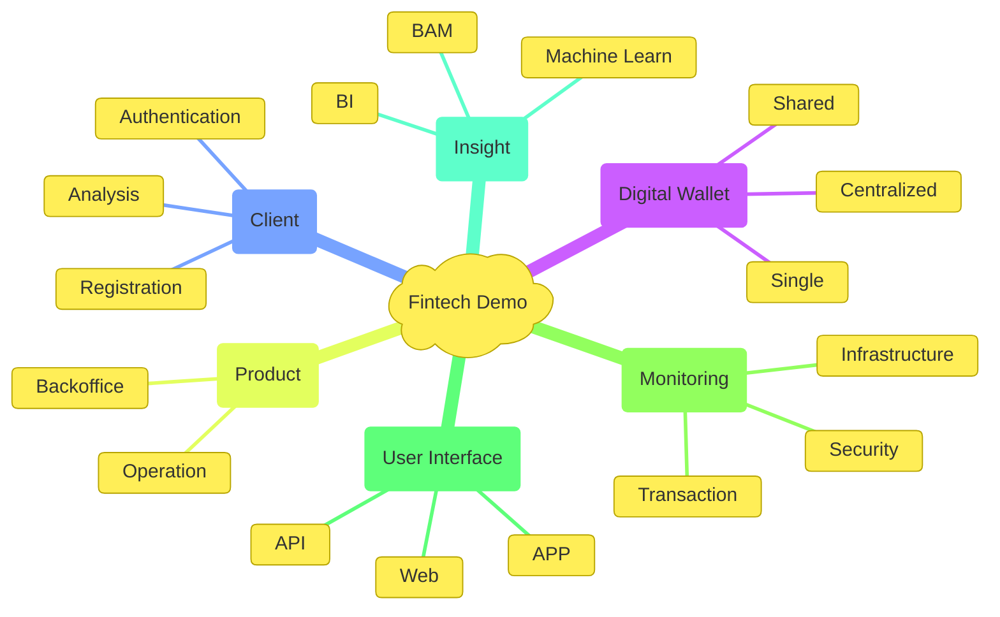

!!! quote "Alert"
    This is an example project whose main purpose is to demonstrate the ability of the group of designers and developers to plan, manage and develop robust and high-performance software, always worrying about the objective, malleability, and time to market.  

The fintech project was chosen due to its complexity involving high security, performance, guaranteed delivery and sequence of operations; which helps to demonstrate the full technical and management capacity of the group developing the project.

As this project is non-profit, we chose to release it under the [AGPL license](https://www.gnu.org/licenses/agpl-3.0.en.html) (Affero General Public License), which guarantees that any modifications made must be released under the same license, guaranteeing continuous improvement of the system.

Take some time to read and understand the context of the project and its thresholds. It is worth remembering that this is not a complete fintech project, it is just an example of the development of some interconnected modules that make sense in this business model.

## Overview

