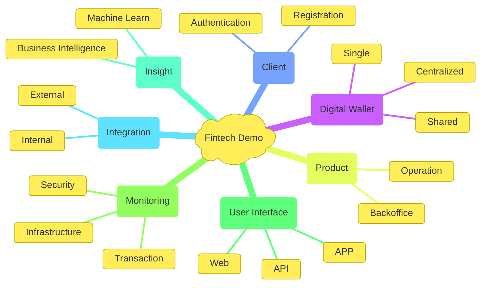

Fintech is a financial technology company, that is, companies that use technological innovation to provide financial services in a more efficient, accessible and innovative way.

Based on it description, we create this example project whose main objective is to demonstrate the ability of the group of architects, engineers, and developers to plan, manage and develop robust and high-performance software, always worrying about the objective, malleability, and time to market. 

## Mindmap

Presented below, in the form of a mind map, there is our conception of a core platform for operating a fintech in the initial phase.

## The View

In our view, the cornerstone for building a platform for a fintech is the trinity of Customer, Product, and Digital Wallet. These three working together enable fluid dynamics for any kind of fintech.

Having as the heart of this model, the digital wallet acts independently of the two other entities of this trinity, which means that validation actions at the product and user level are previously carried out asynchronously, thus enabling a gain in performance.

Alongside the core trinity, there is the observability provider duo that is made up of Insight and monitoring. This duo must provide easy access to technical and business health information, which helps fintech to understand the business itself, find possible problems and their causes, and also make some predictions based on the data collected.

Finally, we have the Interoperability duo, which is made up of User Interface and Integration. This duo enables controlled access to the fintech environment, thus ensuring pleasant interaction with the user and robust integration with peripheral systems.

You can find more information about this solution in [Solutions](./solution/about.md) and [Architecture](./architecture/solution.md). Take the time to read these modules in detail, it may make difference when using part of this code or even designing something similar.

## The Project

The fintech project was chosen due to its complexity involving high security, performance, guaranteed delivery and sequence of operations; which helps to demonstrate the full technical and management capacity of the group developing the project.

As this project is non-profit, we chose to release it under the [GNU Affero General Public License](../license.md), which guarantees that any modifications made must be released under the same license, guaranteeing continuous improvement of the system.

!!! danger "Alert"
    It's worth remembering that this is not a complete fintech project and is not ready for production, so if you want to use it in your company, contact someone from [Our Team](../dev/team.md) and they will be able to help you with this.

Regarding the organization of the project and its requirements, there are five points in this documentation that can be consulted:

* __Home Page:__ The [Home](../index.md) page contains an overview about the business environment and the mental conception of that;
* __Solution:__ 
    *  __Functional Requirements:__ The [Functional Requirements](./solution/functional.md) page contains the detailed description of the project requirementes in a functional layer; 
    * __Technical Requirements:__ The [Technical Requirements](./solution/technic.md) page contains the detailed description of the project requirementes in a technical layer;
    * __Limitations:__ The [Limitations](./solution/limitations.md) page is a very important part of the project management. It describes the project limitation and other points that will not be regarded or developed in any way.  
* __Architecture:__ 
    * __Environment:__ The [Environment](./architecture/environment.md) page contains the detailed description of the environment and their nuances.
    * __Solution:__ The [Solution](./architecture/solution.md) page define the solution using the first three levels of [C4 Model](https://c4model.com/) architecture model.
    * __Software:__ The [Software](./architecture/software.md) page contains the fourth level of [C4 Model](https://c4model.com/) architecture model, where we detail the software in the deep way.
* __Development:__ 
    * __Agile Method:__ The [Agile Method](./dev/agile.md) page contains the development method description;
    * __Repositories:__ The [Repositories](./dev/repositories.md) page list all repositories used to develop this project;
    * __Team:__ The [Team](./dev/team.md) page contains the team presentation and their member.
* __License:__ The [License](./license.md) page contains a copy of the __GNU Affero General Public License__.

 

!!! quote "Backlog Management"
    The backlog management is not documented on this page. We use a tool to it organize!
